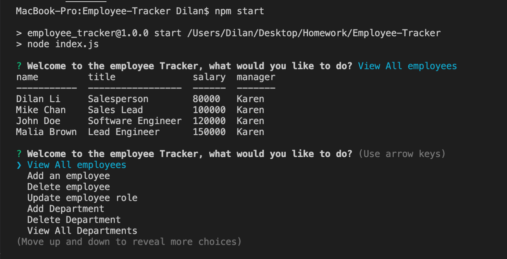
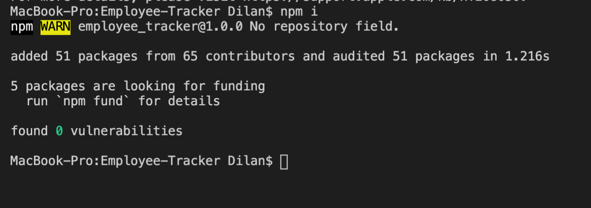

# Employee-Tracker

## Description
The Employee Tracker is a command line application to help businesses track their employee information. This application uses a local server and a database employees_db to store all the data. User can view, update and delete data such as employees information, roles and departments by running the app in the command.

  

## Take of Contents
- [Description](#description)
- [Installation](#installation)
- [Usage](#usage)
- [Video Demo](#video-demo)

## Installation
- clone the repository onto your computer
- open terminal in the root directory, install necessary packages by running the **npm i** command

  

## Usage
- Initiate the app by running **npm start** in the terminal under root directory
- A list of options to organize your employee information will be provided, navigate to the desired option and press enter
- Follow instrusctions in the application to view, add, update or delete data
- You can populate the database with the seed.sql file included to see examples of using the app

  

## Video Demo
For a more elaborate walk through of installation and usage of the app, click on the video demo below:  

